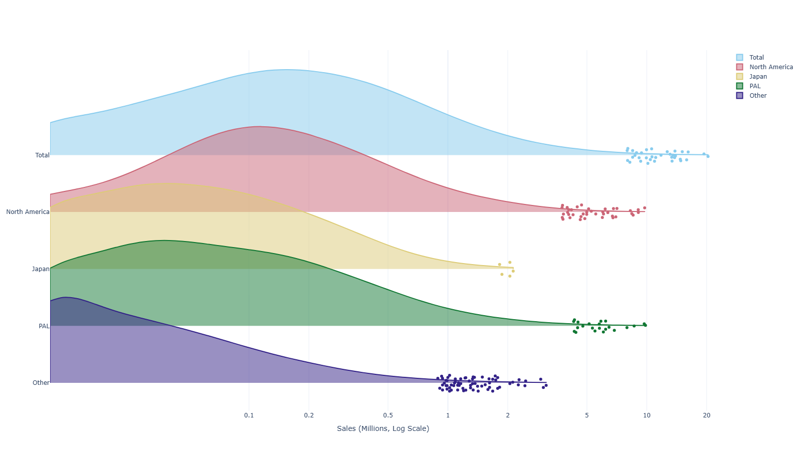

  <picture>
    <source media="(prefers-color-scheme: dark)" srcset="images/demo_chart_dark.png">
    <source media="(prefers-color-scheme: light)" srcset="images/demo_chart_light.png">
    
  </picture>

# Video Game Sales EDA

An exploratory data analysis and sales forecasting project for a hypothetical indie game studio. The notebook walks through data preparation, exploratory analysis, and a predictive model estimating how much a new title might sell across global regions over a five-year horizon.

## Dataset

[Video Games Sales](https://www.kaggle.com/datasets/lamskdna/video-games-sales) by Prithu Verma - video game release and sales data across platforms, genres, publishers, and regions.

## Open in

&nbsp;&nbsp;

## My Experience with DataCamp

Learning data analysis on DataCamp was a pleasant experience for me. From the basics of Python, to data analysis, to modeling, the process was straightforward and gradual. Watching short videos on topics and experimenting with them using a comfortable platform, made things stick better for me, and I could learn at my own pace. Overall, I'd warmly recommend it to newcomers and experienced users who may be interested in data sciences, programming, and other subjects.